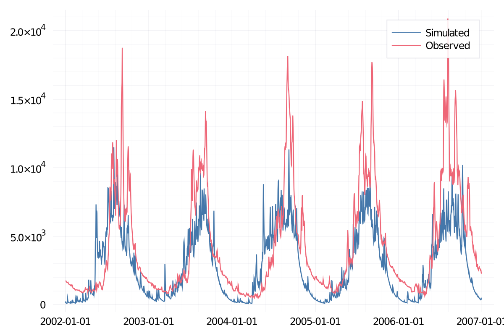

# Hymod.jl

Hymod model implementation in Julia

Simple package with functionality to calibrate/simulate river discharge with the Hymod model.

## Installation

The Hymod package is available through the Julia package system and can be installed using the following commands:.

```
julia> using Pkg
julia> Pkg.add("Hymod")
```

## Example use

```julia
using HTTP, CSV, DataFrames, Hymod

# define url to test data
testDataUrl = "https://raw.githubusercontent.com/JuliaHydro/Hymod.jl/master/test/data/test_forcings.csv"
# get response
response = HTTP.get(testDataUrl)

# read response as a DataFrame
df = CSV.File(response.body) |> DataFrame

# create a column in the data frame for potential evapotranspiration
df[!,:pet] = hargreaves(df,tmincol=:tmin,tmaxcol=:tmax,dtcol=:date)

# get a random set of parameters
pars = randomparams()

# run a simulation
q = simulate(df,precipcol=:precip, petcol=:pet; pars...)
```

### Calibrating a model

```julia
using Dates

# define dates to calibrate
calstart = Date(1986,1,1)
calend = Date(2001,12,31)

# filter dataframe between start and end calibration times
caldf = filter(row -> row[:date] >= calstart && row[:date] <= calend, df)

# get a dictionary of parameter ranges
paramspace = Dict(
    :cmax => Dict(:lower => 1.0, :upper => 100),
    :bexp => Dict(:lower => 0.0, :upper => 2.0),
    :alpha => Dict(:lower => 0.2, :upper => 0.99),
    :ks => Dict(:lower => 0.01, :upper => 0.5),
    :kq => Dict(:lower => 0.5, :upper => 1.2)
)

# set number of iterations to run calibration
niterations = 5000

# run calibration
calq, calpars, calloss = calibrate(caldf,paramspace,niterations)

# get the remainder of dataframe to test calibrated parameters
testdf = filter(row -> row[:date] > calend, df)
# run simulation with calibrated parameters
testdf[!,:q] = simulate(testdf,precipcol=:precip, petcol=:pet; calpars...)

```

When you plot the simulated results compared to observed values, you should get a plot similar to one below.



## Interactive Examples

A Docker image is provided for users that want to run a contained installation of the Hymod model interactively in the browser using [Pluto notebooks](https://github.com/fonsp/Pluto.jl). To start the Pluto server with Hymod, run the following command in your terminal:

```
$ docker run --rm -v julia -e 'import Pluto; Pluto.run()' -p 1234:1234 kmarkert/julia-hymod:latest
```

Next, paste the following URL into the "Open from file" prompt: https://github.com/KMarkert/Hymod.jl/blob/master/examples/hymod_interactive_parameters.jl
